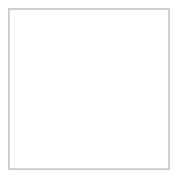

# Surface Code Error Correction Using Cirq

Stephen Habegger

Phys 575

University of Washington - Autumn 2020

## Installation

To install the required packages, run:

```bash
$ pip install -r requirements.txt
```

If you prefer to try installing the latest releases, there are only two direct dependencies:

```bash
$ pip install cirq
$ pip install more-itertools
```

## Background



## References

Fowler, Austin G, Mariantoni, Matteo, Martinis, John M, & Cleland, Andrew N. (2012). Surface codes: Towards practical large-scale quantum computation. Physical Review. A, Atomic, Molecular, and Optical Physics, 86(3), Physical review. A, Atomic, molecular, and optical physics, 2012-09-18, Vol.86 (3).

Roffe, J. (2019). Quantum error correction: An introductory guide. Contemporary Physics, 60(3), 226-245.

Criger, Ben, & Ashraf, Imran. (2018). Multi-path Summation for Decoding 2D Topological Codes. Quantum, 2, 102.
