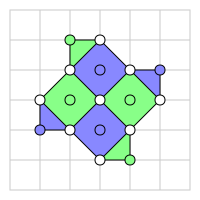

# Surface Code Error Correction Using Cirq

Stephen Habegger

Phys 575

University of Washington - Autumn 2020

## Installation

To install the required packages, run:

```bash
$ pip install -r requirements.txt
```

If you prefer to try installing the latest releases, there are only two direct dependencies:

```bash
$ pip install cirq
$ pip install more-itertools
```

## Running

To run the demonstration, simply run `main.py`.

## Background

For details on Cirq, check [here](https://quantumai.google/cirq).

The surface code is a quantum computing error correcting and stabilizing code. It is based on the toric code, which was originally developed by Kitaev[1].

In the surface code, qubits can be conceived of as existing on a 2 dimensional lattice and interacting with each of their 4 nearest neighbors (or 2 or 3 neighbors on the boundary), though this is not necessarily a physical requirement of the system. However, the code is well suited to architectures that do adhere to this geometry, such as many superconducting processors.

Here, we implement a surface code on a grid, placing qubits at vertices, as in the below figure displaying a D = 3 code.



Here the white qubits represent data qubits. Together, these qubits represent the state of a single logical qubit. The green and blue qubits represent X and Z measurement qubits, respectively. The large colored blocks represent stabilizer groups. They are removed in the following image to make clear the qubit connectivity.


The code is implemented to support an arbitrary distance D, where the logical qubit is composed of DxD data qubits. A surface code must contain N = D^2 data qubits and N - 1 = D^2 - 1 measurement qubits. The measurement qubits are measured periodically, stabilizing the qubit by projecting onto a particular state. Furthermore, these measurements are used to determine and address an error syndrome. Due to these measurements, the logical qubit must contain one more data qubit than measurement qubits to maintain the necessary 2 degrees of freedom required by a logical qubit.

While this code does support arbitrary distance D, the built-in Cirq simulator was capable of running the circuit with no more than distance D = 2 on my home computer, so this is what was used for testing and demonstration.

## Demonstration

The demonstration run by `main.py` is performed on a grid of qubits as the images below. The qubits are zero-index numbered starting from the top-left corner, leaving the boundary empty (as an indexing boundary condition simplification in the program).


A point to note in the program is that each qubit is variously referenced by two separate sets of indices. First, there are the actual grid indices, indicated by `(i, j)` in the code and by the circuit diagram generated by Cirq. However, if we rotate the image clockwise by 45 degrees we find natural grid patterns in the data and measurement qubits, which are indexed separately and referenced in the code as `(x, y)`.

The demonstration in `main.py` runs 5 short tests.

### `printSimpleX()`

This function creates a short Cirq circuit with a single qubit, acted on by an `X` rotation and a measurement. It outputs the circuit diagram:

```
Simple Qubit: ───X───M───
```

### `printX()`

This function creates the D = 2 circuit with a few specialized details excluded to show better show the essence of the program. It outputs the circuit for a logical `X` operation followed by stabilizing syndrome measurements:

```
(1, 2): ───X───────────@──────────────────────────────────────X──────────────────────────────────
                       │                                      │
(1, 3): ───────H───I───@───I───@───H───M('MZ_(0, 1)_1')───────┼──────────────────────────────────
                               │                              │
(2, 1): ───────────@───────────┼──────────────────────────────┼───────X──────────────────────────
                   │           │                              │       │
(2, 2): ───────────┼───────────┼──────────────────────────H───@───@───@───@───M('MX_(1, 1)_1')───
                   │           │                                  │       │
(2, 3): ───X───────┼───────────@──────────────────────────────────X───────┼──────────────────────
                   │                                                      │
(3, 1): ───────H───@───I───@───I───H───M('MZ_(2, 1)_1')───────────────────┼──────────────────────
                           │                                              │
(3, 2): ───────────────────@──────────────────────────────────────────────X──────────────────────
```

Here you can see the `(i, j)` indices used by Cirq on the left side. The measurements use a custom naming scheme using the `(x, y)` indices and prefixes `MX` and `MZ` to indicate syndrome measurements.

One challenge posed when using Cirq is that it does not allow for classical control during simulation. However, the protocol for the surface code calls for resetting the measure qubits to the `0` state after measurement. In this code, I got around this by creating additional ancilla qubits for each syndrom measurement. After the measurement, the measure qubit is swapped with the ancilla to "reset" it. I wrote code to omit that step from the circuit diagram for clarity's sake.

### `simulateSimpleX()`

This function simply runs the simple Cirq circuit from above. Qubits are initialized in the `0` state, so as expected the bit flip results in a measured `1` state:

```
Simple Qubit=1
```

### `simulateXNoErrors()`

The demonstration is capable of injecting depolarizing errors that apply a random Pauli gate with probability `p` on each qubit. This function runs the simulation once with `p = 0`.

```
D_(0, 0)=1
D_(0, 1)=1
D_(1, 0)=0
D_(1, 1)=0
MX_(1, 1)_1=0
MZ_(0, 1)_1=0
MZ_(2, 1)_1=0
```

### `simulateXWithErrors()`

This test runs the simulation 100 times at `p = 0.05`. It reads syndrome measurements to check for errors. In cases where no error is detected, we determine whether the final state can be mapped to a logical qubit state. If so, we also check that we get the correct logical value of `1`.

The output here will vary from run to run, but here is a representative sample:

```
Errors: 19
Measurements: 81
Correct Measurements: 80
```

With 4 data qubits at `p = 0.05`, this error rate seems reasonable. We are able to map `100 - 19 = 81` logical states. The logical state measurements and errors don't necessarily have to add to `100` if there are certain types of overlapping errors. However, with `p = 0.05`, the probability of overlapping errors is small. However, we can see that on one occassion we did receive an overlapping error which, while it did map to a logical state, it incorrectly mapped to the `0` logical state.

In general, we should be able to correct errors that we find. However, since each measurement qubit is connected to multiple data qubits, this generally requires multiple syndrome measurements from separate measurement qubits to disambiguate the offending qubit. With `D = 2` we only have one syndrome measurement qubit for each data qubit, so this is not possible.

Furthermore, the syndrome measurement step usually iterates several times. We would then generate a graph of syndrome measurements and use a minimum-weight perfect matching (MWPM) algorithm to determine what qubits errored and at what time in the computation[2]. However, this is beyond the scope of this project.

## References

[1] Fowler, Austin G, Mariantoni, Matteo, Martinis, John M, & Cleland, Andrew N. (2012). Surface codes: Towards practical large-scale quantum computation. Physical Review. A, Atomic, Molecular, and Optical Physics, 86(3), Physical review. A, Atomic, molecular, and optical physics, 2012-09-18, Vol.86 (3).

[2] Criger, Ben, & Ashraf, Imran. (2018). Multi-path Summation for Decoding 2D Topological Codes. Quantum, 2, 102.

[3] Roffe, J. (2019). Quantum error correction: An introductory guide. Contemporary Physics, 60(3), 226-245.
